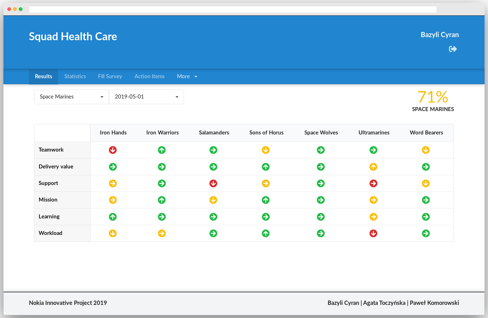

# Squad Health Care App

Originally developed by [Bazyli Cyran](https://github.com/bcyran), [Agata Toczyńska](https://github.com/agatatocz) and [Paweł Komorowski](https://github.com/PawelKomorowski)

## The idea
Squad Health Care App, inspired by [Spotify](https://labs.spotify.com/2014/09/16/squad-health-check-model/), is an all-in-one solution for monitoring employees satisfaction. It allows managers to create surveys in which teams rate their satisfaction in certain areas such as "Teamwork" or "Delivering value". Aside from gathering data, the app also visualizes it in easy to understand form, allowing managers to quickly assess their department's current health and its trends. We belive this solution will help to promote open discussion about problems and, as a result, will create more friendly workplaces.

It's a web application with front-end created using React.js and Redux. Back-end is an Flask based RESTful API written in Python, with Postgres database. The whole app is containerized using Docker.

## Features overview
Regular users (employees) in Squad Health Care App are divided between _tribes_ and _teams_. Each tribe has its own _surveys_ and _editors_). Editors are responsible for creating and maintaining team structure and surveys in their tribes.

Surveys are built from multiple _questions_ relating to different areas of work environment. When filling a survey, teams rate each area in 0, 1, 2 scale. If the answer is 0 or 1 team has to provide additional comment explaining what problems they are experiencing.

Teams have their members and managers. Once during the _survey period_, which can be multiple of one month, one of the members of each team submits answer to a survey after filling it together with an entire team. 

Ratings of all teams in a given tribe are visible for all users related to that tribe, i.e. team members, managers and editors. The comments, however, can be seen only by members of given team and this team's manager.

## Usage
### Prerequisites
* This app relies on LDAP server for fetching user data, therefore it cannot run without one.

* As the app is containerized with Docker you need to have `docker` and `docker-compse` installed.

* Before running you have to create `config.py` in root project directory by copying `config.py.sample` and changing all setting to your needs.

### Running
Using images from Docker Hub:

    docker-compose up -d
    
You can also build images yourself:

    docker-comopse build

## Developer documentation
Developer documentation is available on [project Wiki](https://github.com/nokia-wroclaw/innovativeproject-health-care/wiki/Squad-Health-Care-App-Wiki).
